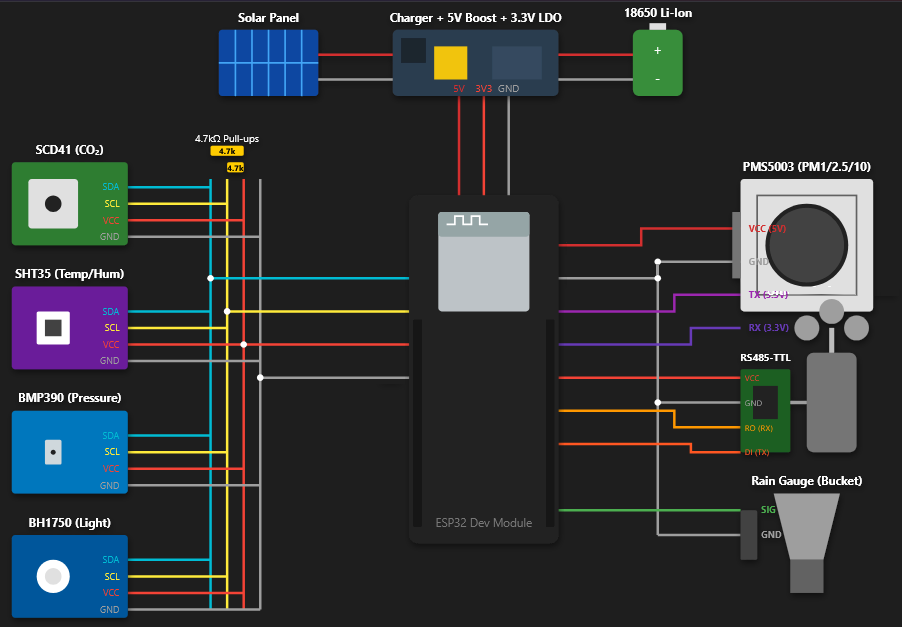

<div align="center">


### **A distributed environmental intelligence network.**
**Measure the environment. Understand the change. Act before it becomes a problem.**

EcoPulse is an **ESP32-powered, solar-assisted environmental sensing network** designed to transform scattered environmental measurements into a living, high-resolution picture of the places we inhabit.

[**🌐 View the Live Dashboard**](https://ecopulse-dashboard-teal.vercel.app/)

</div>

---

## 🌍 The Idea

Environmental data is often **too sparse, too slow, or too disconnected** to tell us what is actually happening at street level.

A single weather station can tell you what is happening *there*.

EcoPulse is designed to tell you what is happening **across an entire environment**.

We deploy distributed sensor nodes across **cities, campuses, industrial areas, agricultural zones, and other monitored environments**. Each node continuously observes its surroundings and contributes measurements to a shared environmental data layer.

The result is more than a collection of sensors.

It is a **living environmental map**.

```text
                    ┌──────────────────┐
                    │   EcoPulse Node  │
                    │                  │
                    │  Air • Weather   │
                    │  Light • Rain    │
                    └────────┬─────────┘
                             │
                             ▼
                  ┌─────────────────────┐
                  │   Environmental     │
                  │      Data Layer     │
                  └──────────┬──────────┘
                             │
              ┌──────────────┼──────────────┐
              ▼              ▼              ▼
        Live Mapping    Anomaly Detection   Trends
              │              │              │
              └──────────────┼──────────────┘
                             ▼
                   Better Decisions
```

---

# ⚡ What EcoPulse Enables

### 🗺️ Environmental Mapping

Turn thousands of individual measurements into a spatial picture of environmental conditions.

Identify **hotspots, gradients, unusual regions, and changing conditions** that would disappear inside a single averaged measurement.

### 🚨 Anomaly Detection

Environmental problems rarely announce themselves politely.

EcoPulse can provide the foundation for detecting unusual combinations or sudden changes in:

- CO₂ concentration
- Particulate matter
- Temperature
- Humidity
- Atmospheric pressure
- Wind
- Rainfall
- Light levels

The goal is simple:

> **Detect deviations while they are still deviations, rather than after they become incidents.**

### 📈 Long-Term Environmental Intelligence

Continuous measurements create something a one-time survey cannot:

**history.**

Longitudinal data can reveal seasonal patterns, persistent pollution zones, changing microclimates, weather relationships, and environmental trends over months or years.

### ⚙️ Rapid Response

When conditions change unexpectedly, a distributed network can provide localized information instead of forcing decision-makers to rely on broad regional averages.

That creates the foundation for faster investigation and response.

### 🌱 Planning & Sustainability

Environmental intelligence can support decisions around:

- Urban planning
- Campus infrastructure
- Green-space management
- Air-quality initiatives
- Pollution mitigation
- Environmental research
- Agricultural monitoring
- Climate adaptation
- Infrastructure planning

EcoPulse is ultimately about **making environmental data actionable**.

---

# 🛰️ The EcoPulse Node

Each node is designed as a compact environmental observation station.

### ☀️ Power Unit

- **Solar Panel**
- **Li-Ion Battery**

The objective is to enable nodes to operate independently from conventional mains infrastructure, making deployment across distributed locations considerably more practical.

### 🧠 Processing

**ESP32**

The ESP32 acts as the local edge controller, handling sensor acquisition, processing, communication, and node-level logic.

### 🌡️ Sensor Stack

| Measurement | Sensor | Purpose |
|---|---|---|
| **CO₂** | SCD41 | Atmospheric CO₂ concentration |
| **Particulate Matter** | PMS5003 | PM1.0, PM2.5 & PM10 |
| **Temperature** | SHT35 | Ambient temperature |
| **Humidity** | SHT35 | Relative humidity |
| **Wind Speed** | Ultrasonic Anemometer | Wind velocity |
| **Wind Direction** | Ultrasonic Anemometer | Wind direction |
| **Air Pressure** | BMP390 | Atmospheric pressure |
| **Rainfall** | Tipping Bucket Rain Sensor | Precipitation measurement |
| **Light Intensity** | BH1750 | Ambient illuminance |

## Sample Pinout Diagram


---

# 🧬 From Sensor to Intelligence

EcoPulse is deliberately designed as a **network**, rather than a collection of independent gadgets.

A typical data flow looks like:

```text
┌─────────────┐
│   Sensors   │
└──────┬──────┘
       │
       ▼
┌────────────────┐
│      ESP32     │
│ Edge Processing│
└───────┬────────┘
        │
        ▼
┌────────────────┐
│ Communications  │
└───────┬────────┘
        │
        ▼
┌──────────────────────┐
│ Environmental Dataset│
└──────────┬───────────┘
           │
           ▼
┌───────────────────────────────┐
│        EcoPulse Platform      │
│                               │
│  Maps • Trends • Anomalies    │
│  History • Visualization      │
└───────────────┬───────────────┘
                │
                ▼
       ┌──────────────────┐
       │ Human Decisions  │
       └──────────────────┘
```

The hardware is only the beginning.

**The value comes from what the network can learn from the data.**

---

# 🖥️ Live Simulation

Before deploying a physical network, EcoPulse includes an interactive simulation demonstrating what a distributed deployment can look like.

The dashboard uses a **sample network of environmental nodes and simulated sensor data** to visualize the concept at scale.

### Explore the prototype

<div align="center">

### **[🌐 Open EcoPulse Dashboard →](https://ecopulse-dashboard-teal.vercel.app/)**

*Explore the simulated environmental network.*

</div>

The simulation provides a glimpse into the eventual experience of interacting with a real EcoPulse deployment:

**nodes → measurements → spatial intelligence → environmental awareness**

---

# 🏙️ Designed to Scale

The architecture is fundamentally distributed.

One node can observe a location.

A network can observe an **environment**.

```text
       NODE 01                 NODE 02
     ┌─────────┐             ┌─────────┐
     │ Sensors │             │ Sensors │
     └────┬────┘             └────┬────┘
          │                         │
          └──────────┬──────────────┘
                     │
                 NODE NETWORK
                     │
          ┌──────────┼──────────┐
          │          │          │
       NODE 03    NODE 04    NODE 05
          │          │          │
          └──────────┼──────────┘
                     │
                     ▼
             ENVIRONMENTAL MAP
```

This makes the concept applicable to deployments ranging from a **small research site** to a **large distributed environmental network**.

Potential deployment environments include:

- 🏫 **Schools & Universities**
- 🏙️ **Cities & Urban Areas**
- 🏭 **Industrial Zones**
- 🌾 **Agricultural Regions**
- 🌳 **Parks & Green Spaces**
- 🏗️ **Construction Sites**
- 🧪 **Research Environments**
- 🏘️ **Residential Communities**

---

# 🔬 Why Distributed Sensing?

Environmental conditions are not uniform.

A city does not have one temperature.

A campus does not have one air-quality measurement.

A neighborhood does not experience rainfall, wind, particulate pollution, or CO₂ concentrations identically at every location.

**Spatial resolution matters.**

EcoPulse approaches environmental monitoring from the opposite direction of centralized measurement:

> Instead of asking *“What is the environment doing?”*  
> **Ask *“What is the environment doing here, here, and here?”***

That distinction is where the network becomes interesting.

---

# 🧠 Future Intelligence Layer

The current system establishes the sensing foundation. From there, the dataset can support increasingly sophisticated analysis.

Potential future capabilities include:

### Predictive Analytics

Use historical measurements to identify emerging environmental trends and forecast expected conditions.

### Multi-Variable Correlation

Explore relationships between environmental variables.

For example:

```text
Wind ↑
   │
   ├── PM concentration changes
   │
   ├── Temperature changes
   │
   └── Local pollution distribution shifts
```

Rather than examining each sensor independently, EcoPulse can eventually reason about **the environment as a system**.

### Spatial Anomaly Detection

Identify nodes whose measurements significantly diverge from neighboring nodes or expected historical behavior.

### Environmental Event Detection

Potentially identify events such as:

- Sudden particulate spikes
- Unusual CO₂ accumulation
- Rapid pressure changes
- Rainfall events
- Localized environmental anomalies

### Historical Environmental Intelligence

Build a persistent environmental record that allows future decisions to be informed by **what actually happened**, rather than what someone remembers happening.

Human memory: famously not a database.

---

# 🛠️ Technology

| Layer | Technology |
|---|---|
| **Edge Controller** | ESP32 |
| **CO₂** | Sensirion SCD41 |
| **Particulate Matter** | PMS5003 |
| **Temperature / Humidity** | Sensirion SHT35 |
| **Pressure** | Bosch BMP390 |
| **Light** | BH1750 |
| **Wind** | Ultrasonic Anemometer |
| **Rainfall** | Tipping Bucket |
| **Power** | Solar + Li-Ion |
| **Visualization** | EcoPulse Web Dashboard |
| **Simulation** | Sample multi-node environmental dataset |

---

# 🚧 Project Status

EcoPulse is currently in the **prototype / development stage**.

The project is being developed around two complementary components:

### 01 — Physical Network

The hardware platform for collecting real-world environmental measurements through distributed sensor nodes.

### 02 — Digital Intelligence Layer

The software platform responsible for transforming measurements into maps, visualizations, historical datasets, anomaly detection, and eventually higher-level environmental intelligence.

The long-term objective is to bridge these two worlds:

> **A physical network that observes the environment, and a digital system that understands it.**

---

# 🎯 The Bigger Picture

EcoPulse is built around a simple premise:

**You cannot manage what you cannot observe.**

Environmental systems are complex, dynamic, and intensely local. The infrastructure used to understand them should reflect that.

A network of inexpensive, distributed, solar-assisted sensing nodes can create a far richer picture than isolated measurements ever could.

The ambition is therefore not to build **another weather station**.

It is to build the **observation layer for the environments we live in**.

```
From a handful of nodes on a campus to a dense environmental network across a city.
From raw sensor readings to patterns.
From patterns to decisions.
```

**That is EcoPulse.**

---

<div align="center">

## 🌱 EcoPulse

### **Observe. Understand. Respond.**

**Environmental intelligence, distributed.**

<br/>

[🌐 **Live Dashboard**](https://ecopulse-dashboard-teal.vercel.app/)

</div>
